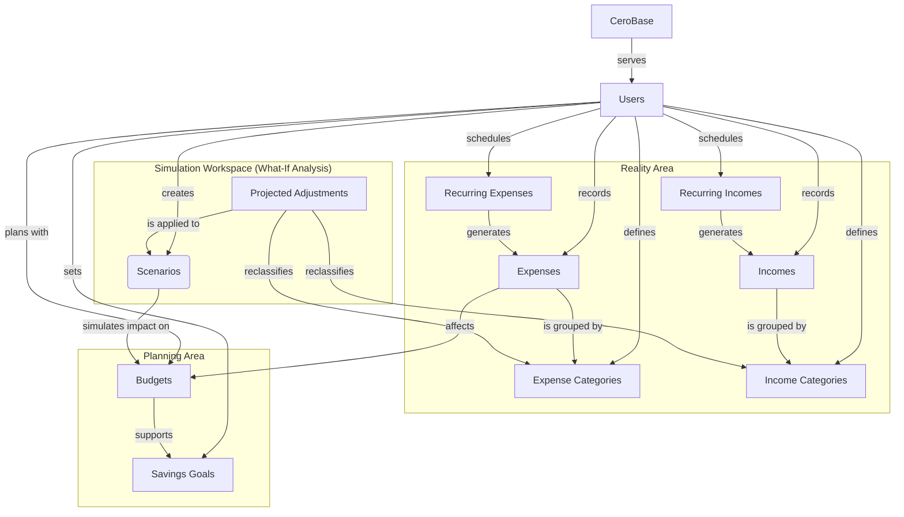

# CeroBase (Finance Tracker)

CeroBase is a web-based personal budgeting application that helps users track income and expenses, manage monthly budgets, define savings goals, and explore financial what-if scenarios.

## Domain Model (Conceptual View)

The following Mermaid diagram represents the CeroBase domain model at a conceptual level:

