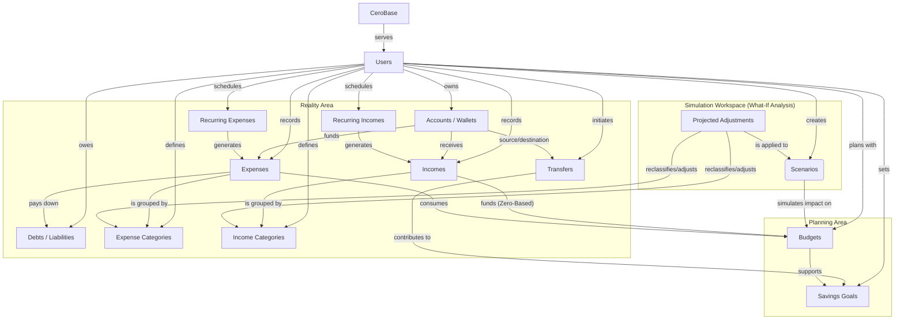

# **CeroBase (Finance Tracker)**

CeroBase is a web-based personal budgeting application that helps users track income and expenses, manage monthly budgets, define savings goals, and explore financial what-if scenarios. Built around the principles of Zero-Based Budgeting, CeroBase ensures every dollar is assigned a purpose.

## **Domain Model (Conceptual View)**

The following Mermaid diagram represents the CeroBase domain model at a conceptual level. It is divided into three core domains:

1. **Reality Area:** Where actual money, accounts, and transactions live.  
2. **Planning Area:** Where future allocations, budgets, and goals are set.  
3. **Simulation Workspace:** A sandbox for hypothetical "What-If" financial analysis.

## **Key Architectural Concepts**

### **1\. The Reality Area (Tracking What Is)**

This domain represents the user's actual financial state.

* **Accounts & Transfers:** Money lives in Accounts (checking, savings, cash). Moving money between them is handled via Transfers rather than creating false incomes/expenses.  
* **Debts & Liabilities:** Tracks loans and credit card balances. Expenses categorized as debt payments directly reduce the principal balance of Debts.  
* **Recurring Engine:** RecurringExpenses and RecurringIncomes act as templates/cron jobs that automatically generate standard Expenses and Incomes over time.

### **2\. The Planning Area (Zero-Based Budgeting)**

This domain is about assigning purpose to incoming money.

* **Funding the Budget:** In a zero-based model, Incomes dictate exactly how much money is available to be allocated to Budgets.  
* **Consuming the Budget:** Real Expenses consume the allocated amounts in those budgets.  
* **Goal Tracking:** Moving money to a savings account (Transfers) actively contributes to your SavingsGoals, bridging the gap between reality and planning.

### **3\. The Simulation Workspace (What-If Analysis)**

A dedicated sandbox environment that allows users to predict the future without altering their current data.

* **Scenarios & Adjustments:** Users can create a Scenario (e.g., "Buying a new car" or "Changing Jobs") and apply Projected Adjustments to categories. The app then simulates the impact on their Budgets and timeline for SavingsGoals.
